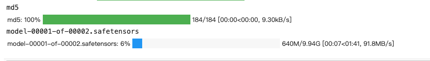

# 通过阿里云盘+colab下载 huggingface大模型
## 前言：
基本所有AI大模型现在托管在huggingface上，国内是无法直接访问的，即使用了镜像站，一个7B的大模型也有至少15G，而镜像站只有1M/s 左右的速度，下载一个6B的模型就要5个小时了；


通过一轮摸索，发现阿里云盘+colab可以大大提速大模型下载时间，有需要的小伙伴可以收藏一下了，下面以开复老师的零一万物大模型Yi-6B举例；

## 1登陆阿里云盘 获得refresh_token
首先通过chrome浏览器按F12进入控制台，搜索应用，找到本地存储空间，从token拿到refresh_token，保存到笔记本；


## 2 colab模型下载huggingface大模型
去colab新建一个python笔记本，可以直接上传我github的源码。

拿到Yi-6B大模型文件列表后，通过下面的函数逐个下载到当前目录下的"./download"目录，colab下载大模型速度是非常快的。如果是66B以上的大模型，改成并行下载会更快，这里是6B就没必要了。

```python
def download_file(repo_id,filenames):
    print(filenames)
    repo_name = repo_id.replace("/","---")

    for filename in filenames:
        print(filename)
        out = hh.hf_hub_download(repo_id=repo_id,filename=filename,local_dir=f"./download/{repo_name}",local_dir_use_symlinks=False,force_download =True)
    out_path = f"./download/{repo_name}"
    return out_path
```

用huggingface_hub直接就拉到了这个速度，都不需要换hf_transfer了


## 3 大模型文件上传到阿里云
这里用到aligo开源库，作者封装了很多细节代码，赞！通过下面的代码确认refresh_token是否可用。

```python
from aligo import Aligo
refresh_token = "注意：改成自己的refresh_token"
ali = Aligo(refresh_token=refresh_token)
user = ali.get_user()  # 获取用户信息
print(user.user_name, user.nick_name, user.phone)
ll = ali.get_file_list()  # 获取网盘根目录文件列表
```

确认用户鉴权没问题之后，把刚下载到colab的大模型传到阿里云盘，快10G的文件，只要2分钟就传完了，如果是热门大模型，应该是秒传的。


## 4 从阿里云下载到本地
从阿里云盘下载到本地，基本也能把家里带宽拉满了，而且阿里云盘的会员可以通过签到白嫖！


结尾
调研和尝试了N种下载大模型的方法，发现还是通过阿里云盘+colab是最高效的，从huggingface到自己电脑上，10分钟就完成了，对比镜像站4-5个小时，真是快太多了。

https://blog.csdn.net/u011075046/article/details/134845584

